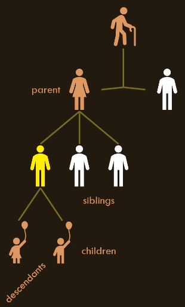
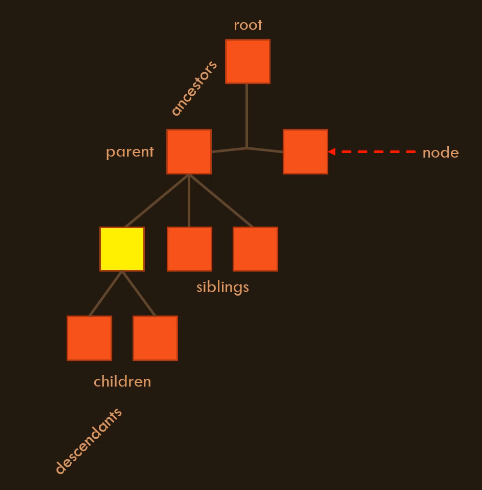

HTML and CSS

Seção 1 - Introdução

    Conteúdo

        -HTML 
        -CSS
        -Árvores (conceitos da Ciência da Computação)
        -Rendering Engines
        -Como ler as especificações
        -Eliminar hábitos ruins
        -Não é necessário experiência
        -Quebrar maus hábitos adquiridos
        -Construir um modelo mental

        Tools and Setup
        -Visual Studio Code
        -Instalar a extensão Live Server

Seção 2 - Trees

    Conceito

        Estrutura de dados - uma maneira de organizar dados para que o computador possa acessar e modificar com rapidez e eficiência.

        Doubly linked list (lista encadeada) - a memórida do computador é organizada com esta estrutura de dados.

        Outros exemplos

        Linked lists
        Arrays
        Trees

    Trees (Árvores)

        Esta estrutura de dados é perfeita para armazenar o tipo de informação que precisamos quando usamos HTML e CSS.

        Na Ciência da Computação "Tree" é representada de cabeça para baixo.

        Root (Raiz) - fica no topo
        Branches (galhos) - ficam abaixo
        Leaves (folhas) - ficam nas extremidades

        $ tree
        . (root)
        ├── dir1 (branch)
        │   ├── file11.ext (leave)
        │   └── file12.ext (leave)
        ├── dir2 (branch)
        │   ├── file21.ext (leave)
        │   ├── file22.ext (leave)
        │   └── file23.ext (leave)
        ├── dir3 (branch)
        ├── file_in_root.ext (leave)
        └── README.md (leave)

        Esta estrutura de dados é baseada na árvore genealógica.

        !Árvore genealógica
        !Tree

